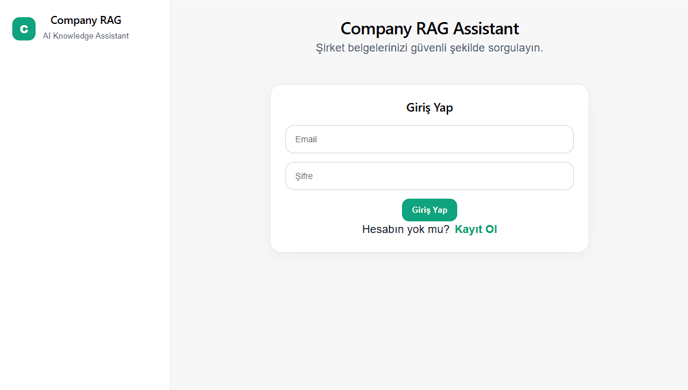
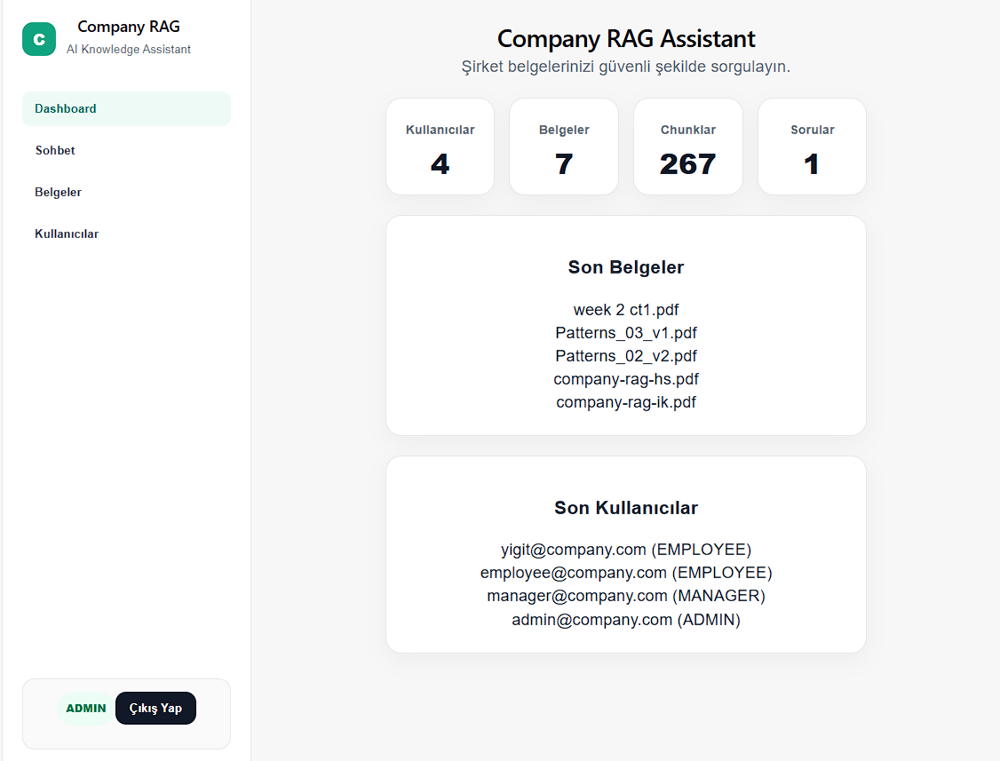
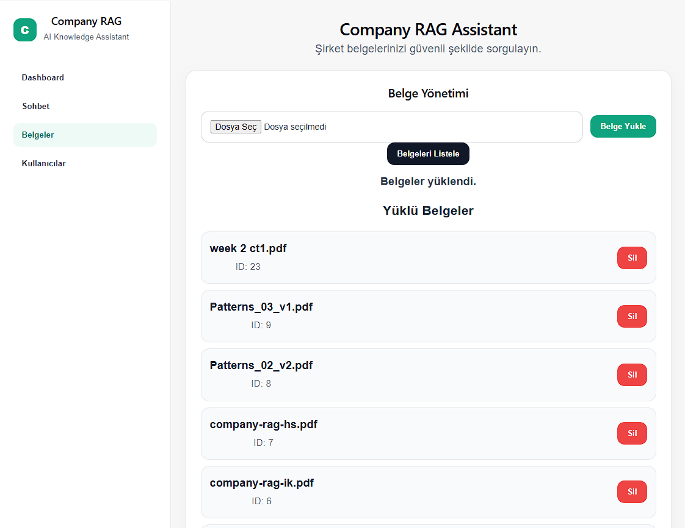
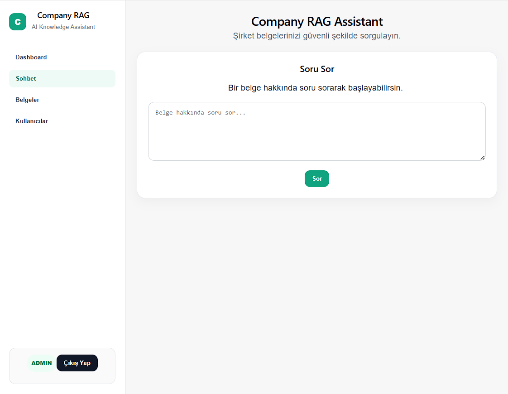
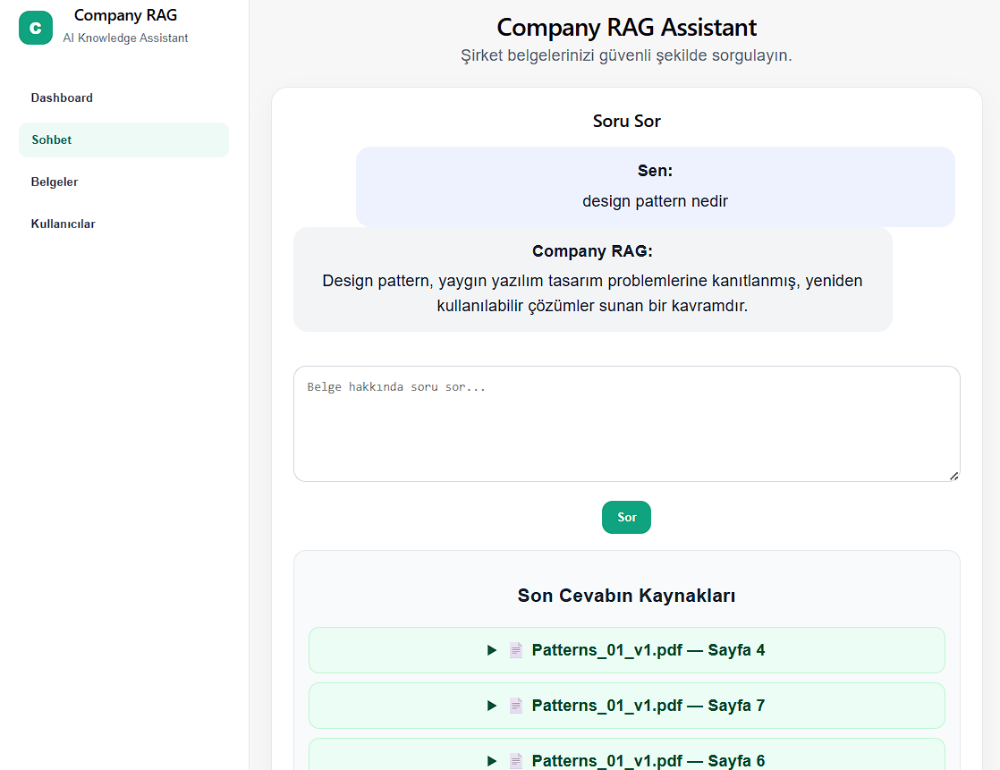
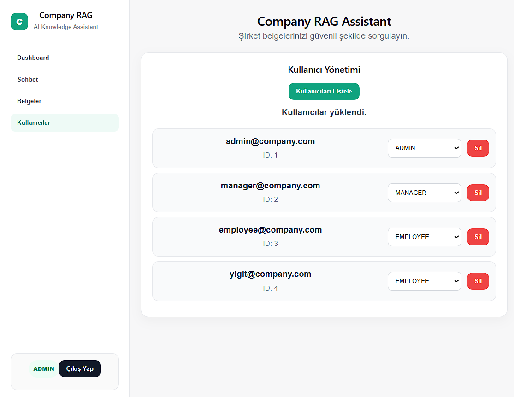
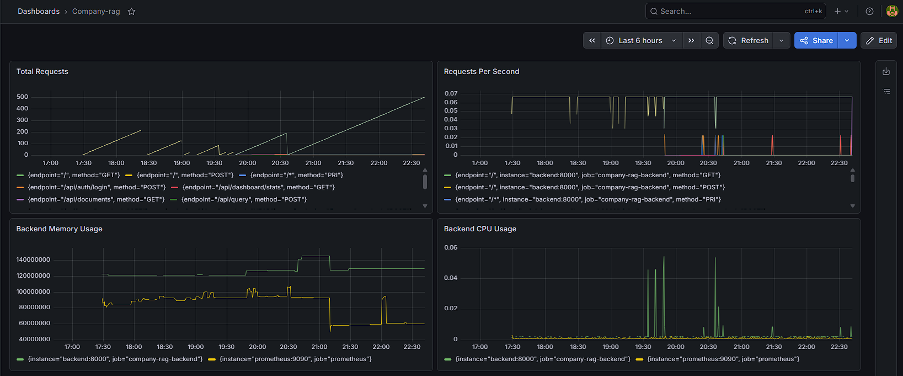

# Company RAG Platform

## AI-Powered Enterprise Knowledge Assistant

Company RAG Platform is a production-oriented Retrieval-Augmented Generation (RAG) platform that enables organizations to upload internal PDF documents and interact with them through natural language queries.

The platform combines modern AI technologies with a complete cloud deployment pipeline, allowing users to retrieve information from company documents through semantic search and AI-generated responses.

---

## Live Demo

**Application**

https://rag.yigitsancar.com

---

## Screenshots

### Login Page

Secure JWT-based authentication and role-based access control.



---

### Admin Dashboard

Real-time platform statistics including users, documents, chunks, and questions.



---

### Document Management

Upload, list, and manage company documents.



---

### RAG Chat Interface

Ask natural language questions and receive AI-generated answers based on uploaded documents.



---

### Source Preview

Every answer includes source references with document name, page number, and retrieved chunk content.



---

### User Management

Role-based user administration for ADMIN, MANAGER, and EMPLOYEE accounts.



---

### Monitoring & Observability

Grafana dashboard powered by Prometheus metrics collection.



---

## Key Features

### Authentication & Authorization

* JWT Authentication
* Secure Login & Registration
* Role-Based Access Control (RBAC)

Roles:

* ADMIN
* MANAGER
* EMPLOYEE

---

### Document Management

* PDF Upload
* Document Listing
* Document Deletion
* Role-Based Permissions

---

### AI-Powered RAG Pipeline

* PDF Text Extraction
* Intelligent Chunking
* OpenAI Embedding Generation
* pgvector Semantic Search
* Context Retrieval
* OpenAI Answer Generation

---

### Source Grounding

Each generated answer includes:

* Document Name
* Page Number
* Retrieved Chunk Content

---

### Dashboard & Analytics

Administrative dashboard provides:

* Total Users
* Total Documents
* Total Chunks
* Total Questions
* Latest Documents
* Latest Users

---

## System Architecture

```text
Users
  │
  ▼
Cloudflare DNS
  │
  ▼
Nginx Reverse Proxy
  │
  ├── React Frontend
  │
  └── FastAPI Backend
          │
          ▼
PostgreSQL + pgvector
          │
          ▼
OpenAI API
```

---

## RAG Pipeline

### Document Processing

```text
PDF Upload
    ↓
Text Extraction
    ↓
Chunking
    ↓
Embedding Generation
    ↓
Vector Storage
```

### Question Answering

```text
Question
    ↓
Embedding
    ↓
Similarity Search
    ↓
Relevant Chunks
    ↓
OpenAI Completion
    ↓
Answer + Sources
```

---

## Monitoring & Observability

### Prometheus

* Backend Metrics
* Availability Monitoring
* Resource Metrics

### Grafana

* Total Requests
* Requests Per Second
* CPU Usage
* Memory Usage

### Alerting

Email notifications are automatically sent when backend availability issues are detected.

---

## CI/CD Pipeline

```text
GitHub Push
      ↓
GitHub Actions
      ↓
Build Backend Image
      ↓
Build Frontend Image
      ↓
Docker Hub Push
      ↓
SSH Deploy to EC2
      ↓
Docker Compose Pull
      ↓
Health Checks
      ↓
Production Deployment
```

Deployment health checks validate:

* /api/docs
* Authentication endpoint

---

## Technology Stack

### Backend

* Python
* FastAPI
* SQLAlchemy
* JWT Authentication

### Frontend

* React
* Vite
* Axios

### Database

* PostgreSQL
* pgvector

### AI

* OpenAI Embeddings
* OpenAI Chat Completions

### Infrastructure

* Docker
* Docker Compose
* GitHub Actions
* Docker Hub
* AWS EC2
* Nginx
* Cloudflare
* Let's Encrypt SSL

### Monitoring

* Prometheus
* Grafana
* Email Alerting

---

## Project Structure

```text
company-rag-assistant
├── backend
├── frontend
├── screenshots
├── monitoring
├── grafana
├── docker-compose.yml
└── README.md
```

---

## Author

**Yiğit Sancar**

Software Engineering Student

Interested in:

* Backend Development
* DevOps
* Cloud Computing
* AI Engineering
* Kubernetes
